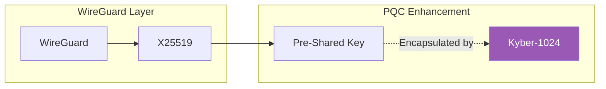

# Post-Quantum VPN Router - WireGuard + PSK

<p align="center">
  <strong>Open Source Production-Ready Post-Quantum VPN</strong>
</p>

<p align="center">
  
  
  
</p>

---

## Overview

Open source implementation using **standard WireGuard** with post-quantum security through Kyber-encapsulated pre-shared keys.

**Most stable and production-ready** variant - uses unmodified WireGuard with an additional PQC layer.

### Security Model



## Quick Start

```bash
git clone https://github.com/vinzabe/post-quantum-vpn-wireguard-psk.git
cd post-quantum-vpn-wireguard-psk
./scripts/setup.sh
docker compose up -d
```

## How PSK + Kyber Works

1. Generate WireGuard PSK: `wg genpsk`
2. Encapsulate PSK with Kyber-1024
3. Exchange encrypted PSK securely
4. Decapsulate and configure WireGuard

The PSK provides quantum resistance because:
- WireGuard mixes PSK into key derivation
- PSK is protected by Kyber during exchange
- Even if X25519 is broken, PSK remains secure

## License

MIT License - See LICENSE file.

## Enterprise Support

**Email:** grant@abejar.net

---

Developed by Abejar | Open Source Edition
